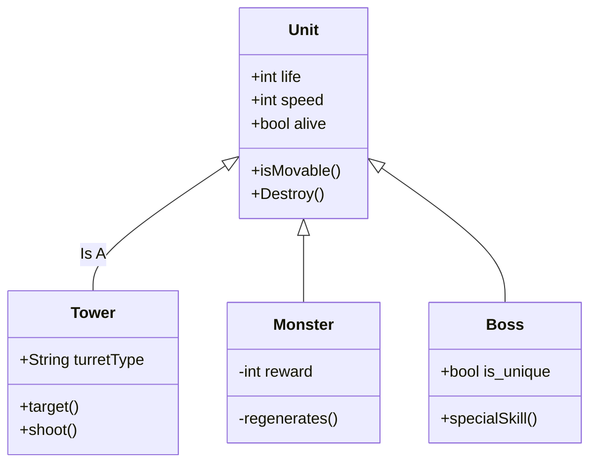

# VoorbeeldExamenRepo
Een voorbeeld repository voor het examenwerk

In deze repository vind je de informatie over het examen project.

Omschrijf de examenopdracht evt de klant en wat het doel voor de klant is.
Omschrijf ook beknopt wat het idee van je game is. 
Een complete en uitgebreide beschrijving komt in het functioneel ontwerp (onderdeel van de [wiki](https://github.com/erwinhenraat/VoorbeeldExamenRepo/wiki))

# Geproduceerde Game Onderdelen

Geef per teammember aan welke game onderdelen je hebt geproduceerd. Doe dit met behulp van omschrijvingen visual sheets en screenshots.
Maak ook een overzicht van alle onderdelen met een link naar de map waarin deze terug te vinden zijn.

Bijv..

Ivo Bergen 
  * [Moving Cubes](ProefExamenGame/Assets/Scripts/MovingCubes)
  * [Some other mechanic X](https://github.com/erwinhenraat/VoorbeeldExamenRepo/tree/master/src/mechanic_x)
  * [Some other mechanic Y](https://github.com/erwinhenraat/VoorbeeldExamenRepo/tree/master/src/mechanic_y)
    
Owen Stas:
  * [respawnSysteem](https://github.com/IvoBergen/ProefExamenRepo/wiki/RespawnSystem)
  * [Some textured and rigged model](https://github.com/erwinhenraat/VoorbeeldExamenRepo/tree/master/assets/monsters)

Christiaan Oosterwouder
  * [Some beautifull script](https://github.com/erwinhenraat/VoorbeeldExamenRepo/tree/master/src/beautifull)
  * Some other Game object

Akari

## Moving Cubes

The moving cubes are made as an obstacle for the player. They Move to random locations decided by the input values on the X an Z axis. The cube also rotates between 90, 0 and -90 degrees to add for an extra layer of difficulty 

This is the visual sheet for the moving cube scripts

### class diagram voor game entities:

## Some other Mechanic X by Student X

Contrary to popular belief, Lorem Ipsum is not simply random text. It has roots in a piece of classical Latin literature from 45 BC, making it over 2000 years old. Richard McClintock, a Latin professor at Hampden-Sydney College in Virginia, looked up one of the more obscure Latin words, consectetur, from a Lorem Ipsum passage, and going through the cites of the word in classical literature, discovered the undoubtable source. Lorem Ipsum comes from sections 1.10.32 and 1.10.33 of "de Finibus Bonorum et Malorum" (The Extremes of Good and Evil) by Cicero, written in 45 BC. This book is a treatise on the theory of ethics, very popular during the Renaissance. The first line of Lorem Ipsum, "Lorem ipsum dolor sit amet..", comes from a line in section 1.10.32.

## Respawnmechanic door Owen

Dit respawn-systeem zorgt ervoor dat de speler automatisch terug wordt geplaatst op het laatst bereikte checkpoint wanneer hij van het platform valt of een respawn-trigger raakt.
Wanneer de speler de trigger binnenkomt:
Het systeem controleert of er een actief checkpoint is.
De huidige physics van de speler (velocity en angular velocity) worden gereset zodat hij niet blijft bewegen of doorschieten.
De speler wordt verplaatst naar de positie en rotatie van het checkpoint.
Daarna wordt de physics weer geactiveerd zodat de speler normaal verder kan spelen.
Kort gezegd: vallen = resetten naar checkpoint zonder rare physics-bugs.

## Water Shader by Student Y

Contrary to popular belief, Lorem Ipsum is not simply random text. It has roots in a piece of classical Latin literature from 45 BC, making it over 2000 years old. Richard McClintock, a Latin professor at Hampden-Sydney College in Virginia, looked up one of the more obscure Latin words, consectetur, from a Lorem Ipsum passage, and going through the cites of the word in classical literature, discovered the undoubtable source. Lorem Ipsum comes from sections 1.10.32 and 1.10.33 of "de Finibus Bonorum et Malorum" (The Extremes of Good and Evil) by Cicero, written in 45 BC. This book is a treatise on the theory of ethics, very popular during the Renaissance. The first line of Lorem Ipsum, "Lorem ipsum dolor sit amet..", comes from a line in section 1.10.32.

## Some textured and rigged model by Student Y

Contrary to popular belief, Lorem Ipsum is not simply random text. It has roots in a piece of classical Latin literature from 45 BC, making it over 2000 years old. Richard McClintock, a Latin professor at Hampden-Sydney College in Virginia, looked up one of the more obscure Latin words, consectetur, from a Lorem Ipsum passage, and going through the cites of the word in classical literature, discovered the undoubtable source. Lorem Ipsum comes from sections 1.10.32 and 1.10.33 of "de Finibus Bonorum et Malorum" (The Extremes of Good and Evil) by Cicero, written in 45 BC. This book is a treatise on the theory of ethics, very popular during the Renaissance. The first line of Lorem Ipsum, "Lorem ipsum dolor sit amet..", comes from a line in section 1.10.32.

## Some beautifull script by Student Z

Contrary to popular belief, Lorem Ipsum is not simply random text. It has roots in a piece of classical Latin literature from 45 BC, making it over 2000 years old. Richard McClintock, a Latin professor at Hampden-Sydney College in Virginia, looked up one of the more obscure Latin words, consectetur, from a Lorem Ipsum passage, and going through the cites of the word in classical literature, discovered the undoubtable source. Lorem Ipsum comes from sections 1.10.32 and 1.10.33 of "de Finibus Bonorum et Malorum" (The Extremes of Good and Evil) by Cicero, written in 45 BC. This book is a treatise on the theory of ethics, very popular during the Renaissance. The first line of Lorem Ipsum, "Lorem ipsum dolor sit amet..", comes from a line in section 1.10.32.

## Some other Game object by Student Z

Contrary to popular belief, Lorem Ipsum is not simply random text. It has roots in a piece of classical Latin literature from 45 BC, making it over 2000 years old. Richard McClintock, a Latin professor at Hampden-Sydney College in Virginia, looked up one of the more obscure Latin words, consectetur, from a Lorem Ipsum passage, and going through the cites of the word in classical literature, discovered the undoubtable source. Lorem Ipsum comes from sections 1.10.32 and 1.10.33 of "de Finibus Bonorum et Malorum" (The Extremes of Good and Evil) by Cicero, written in 45 BC. This book is a treatise on the theory of ethics, very popular during the Renaissance. The first line of Lorem Ipsum, "Lorem ipsum dolor sit amet..", comes from a line in section 1.10.32.

